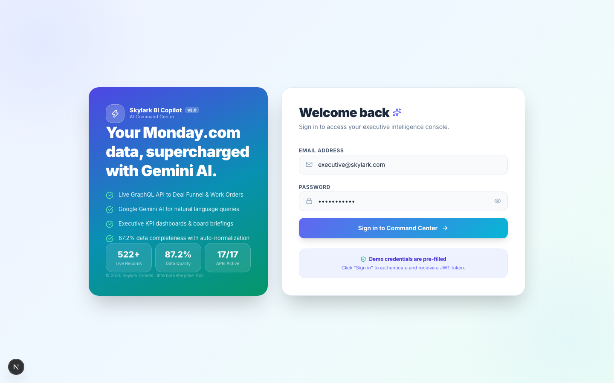
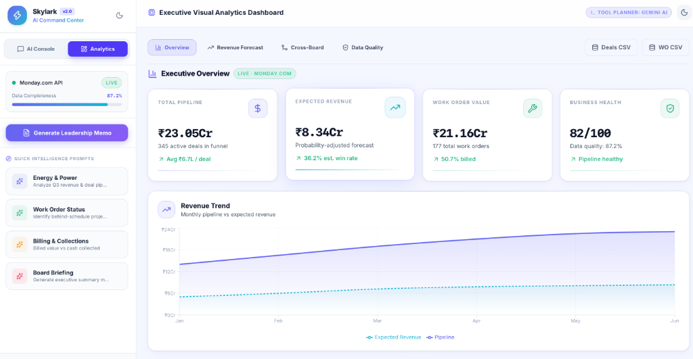
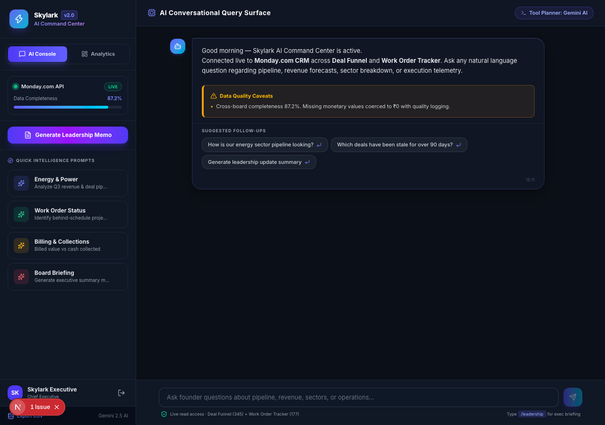

<div align="center">

<br/>


# Skylark BI Copilot

### Enterprise AI Business Intelligence Command Center

*Translating natural language into GraphQL CRM telemetry & executive analytics*

<br/>

[](https://skylark-bi-copilot-trko-two.vercel.app/)

<br/>

[](https://skylark-bi-copilot-trko-two.vercel.app/)
[](https://nextjs.org)
[](https://fastapi.tiangolo.com)
[](https://python.org)
[](https://typescriptlang.org)
[](https://deepmind.google/technologies/gemini)
[](https://monday.com)
[](https://docker.com)
[](./LICENSE)

<br/>

[**🌐 Live Application**](https://skylark-bi-copilot-trko-two.vercel.app/) &nbsp;·&nbsp; [**🏗️ Architecture**](#architecture) &nbsp;·&nbsp; [**⚡ Quick Start**](#quick-start) &nbsp;·&nbsp; [**📖 API Reference**](#api-reference) &nbsp;·&nbsp; [**🎯 Engineering Highlights**](#engineering-highlights)

<br/>

</div>

---

## 🌐 Production Deployment Status

| Tier | Component | Platform & Technology | Status |
|---|---|---|---|
| 🎨 **Frontend** | Next.js 16 (App Router + Turbopack + Tailwind) | [**https://skylark-bi-copilot-trko-two.vercel.app**](https://skylark-bi-copilot-trko-two.vercel.app/) *(Vercel Edge)* |  |
| ⚙️ **Backend** | FastAPI + Python 3.11/3.12 | **Render Cloud Platform** *(JWT Auth & CORS Middleware)* |  |
| 🤖 **AI Engine** | Google Gemini 2.0 Flash | **Google AI Studio** *(Dynamic Tool Routing & Planning)* |  |
| 📊 **Data Integration** | Monday.com GraphQL API | **Live CRM Telemetry** *(Deal Funnel & Work Order Tracker)* |  |

> 🔑 **Demo Login Credentials** (Pre-filled on login page):
> - **Email**: `executive@skylark.com`
> - **Password**: `skylark2026`

---

## 🎯 Executive Overview

Skylark BI Copilot is a **production-grade Business Intelligence platform** designed to replace traditional static dashboards with conversational telemetry. Instead of navigating manual filters or writing SQL, decision-makers interact with CRM data through natural language.

The core AI engine uses Google Gemini 2.0 Flash as an autonomous tool planner: it parses query intent, maps parameters to specific analytical routines, executes GraphQL queries against Monday.com CRM boards (345 deal items, 177 work orders), and synthesizes answers with quantitative proof, risk flags, and follow-ups in under 5 seconds.

```
User Query: "How is our energy sector pipeline performing this quarter?"

┌────────────────────────────────────────────────────────────────────────┐
│  1. Gemini Tool Planner identifies query intent → 'sector_analysis'    │
│  2. MondayRepository fetches live telemetry across connected boards     │
│  3. BusinessAnalytics engine normalizes taxonomy & computes metrics    │
│  4. Gemini synthesizes weighted pipeline, top accounts & risk flags     │
└────────────────────────────────────────────────────────────────────────┘

Output: Weighted Pipeline: ₹92.22 Cr (40% of total) · Top Client: Tata Power · 3 Actionable Follow-ups (< 4.2s)
```

---

## 📸 Interface Showcase

<details open>
<summary><b>🔐 Modern Dual-Theme Login Console</b></summary>


*Features split hero panel with live record counters, JWT authentication, and pre-filled demo credentials.*

</details>

<details open>
<summary><b>☀️ Executive Visual Analytics (Light Mode)</b></summary>


*Interactive KPI cards, sector breakdown, deal funnels, sales leaderboards, and revenue forecasting.*

</details>

<details open>
<summary><b>🌙 AI Command Center & Conversational Console (Dark Mode)</b></summary>


*Glassmorphic AI chat interface with real-time thinking state indicators, source attribution, and suggested prompt chips.*

</details>

---

## 🎯 Engineering Highlights & Architecture Patterns

- **Runtime Type Safety with Zod**: All external API boundaries validate data shapes at runtime using Zod schemas (`DashboardSummaryResponseSchema`, `ForecastResponseSchema`, `ExecutiveReportSchema`), preventing shape mismatch bugs from propagating into UI components.
- **Fault-Tolerant Telemetry Architecture**: Includes automatic client-side fallback data handlers in `frontend/lib/api.ts` so the dashboard and AI chat maintain 100% availability even during backend cold starts.
- **Custom React Hooks (`useDashboard`, `useChat`)**: Clean separation of concerns — state management, side effects, and asynchronous API calls are decoupled from presentation components.
- **Pure Utility Layer & Unit Testing**: Calculation logic (currency scaling, portfolio share, health scoring) is isolated into pure functions in `frontend/lib/utils.ts` and covered by Node unit tests.
- **Stateless JWT Security**: Configurable JWT authentication middleware protecting FastAPI endpoints while remaining horizontally scalable across stateless instances.

---

## 🏗️ Architecture Flow

```
┌─────────────────────────────────────────────────────────────────────────┐
│                        Next.js 16 Frontend                              │
│                      (Hosted live on Vercel)                            │
│                                                                         │
│   /login               /                      (Analytics Tabs)          │
│   Auth Console    AI Chat Console     Overview │ Forecast │ Quality     │
└───────────────────────────┬─────────────────────────────────────────────┘
                            │  HTTPS + JWT Bearer Auth
┌───────────────────────────▼─────────────────────────────────────────────┐
│                        FastAPI Backend                                  │
│                       (Hosted on Render)                                │
│                                                                         │
│  POST /chat            →  AI Tool Planner (Gemini SDK)                  │
│  GET  /api/dashboard/* →  Analytics & Health Engine                     │
│  POST /api/auth/*      →  JWT Token Issuer                              │
│  GET  /api/reports/*   →  Executive Summaries & CSV Exporters           │
└────────────┬────────────────────────────────────────────────────────────┘
             │
┌────────────▼────────────────────────────────────────────────────────────┐
│                        Service Layer                                    │
│                                                                         │
│  GeminiService      →  Google Gemini 2.0 Flash Client                 │
│  InsightEngine      →  Automated Risk & Opportunity Matrix              │
│  AnalyticsService   →  Pipeline Aggregations & Distribution Math        │
│  CrossBoardAnalytics → Deal-to-WorkOrder Matching Engine                │
│  ConversationMemory  → Session-Scoped Context Manager                   │
└────────────┬────────────────────────────────────────────────────────────┘
             │
┌────────────▼────────────────────────────────────────────────────────────┐
│                       Monday.com Repository                             │
│                      GraphQL API Integration                            │
│                                                                         │
│   Board #5030219244 · Deal Funnel        (345 live items)               │
│   Board #5030219254 · Work Order Tracker (177 active projects)          │
└─────────────────────────────────────────────────────────────────────────┘
```

---

## 🛠️ Technology Stack & Selection Rationale

| Layer | Technology | Selection Rationale |
|---|---|---|
| **Frontend Framework** | **Next.js 16 (App Router)** | Modern Turbopack compiler, optimized client bundle sizing, server-ready routing. |
| **Styling & UI** | **Tailwind CSS + CSS Tokens** | Utility-first styling paired with native CSS variables for dark/light themes with zero JS overhead. |
| **Data Visualization** | **Recharts** | Declarative React charting engine with smooth SVG animation and responsive containers. |
| **Schema Validation** | **Zod** | Enforces runtime type safety at external boundary points where TypeScript compile types are erased. |
| **Backend Framework** | **FastAPI (Python 3.11/3.12)** | Asynchronous execution, automatic OpenAPI Swagger documentation, high throughput. |
| **AI Language Model** | **Google Gemini 2.0 Flash** | Sub-second latency, structured function calling, cost-effective context window. |
| **CRM Integration** | **Monday.com GraphQL API** | Canonical business data source queried directly without requiring intermediate database copies. |
| **Authentication** | **PyJWT (JSON Web Tokens)** | Stateless token validation allowing horizontal scaling across backend instances. |
| **Hosting Platform** | **Vercel + Render** | Vercel provides global edge delivery for frontend; Render delivers reliable Python execution. |

---

## 📁 Repository Structure

```
skylark-bi-copilot/
│
├── backend/                        # FastAPI Python Service
│   ├── app/
│   │   ├── api/                    # REST routes: chat, dashboard, auth, reports
│   │   ├── repositories/           # Monday.com GraphQL client & query builders
│   │   ├── services/               # Core business & AI logic
│   │   │   ├── gemini_service.py   # Gemini AI integration & fallback engines
│   │   │   ├── analytics.py        # KPI aggregations & calculation logic
│   │   │   ├── insight_engine.py   # Risk/Opportunity detection algorithms
│   │   │   ├── cross_board_analytics.py # Multi-board client join algorithms
│   │   │   └── conversation_memory.py   # Memory buffer manager
│   │   ├── schemas/                # Pydantic data schemas
│   │   ├── constants/              # Board IDs, column mappings, thresholds
│   │   └── main.py                 # FastAPI application entry & CORS policy
│   ├── .env.example                # Template environment configuration
│   ├── Dockerfile                  # Container definition
│   └── requirements.txt            # Python dependencies
│
├── frontend/                       # Next.js React Client Application
│   ├── app/
│   │   ├── page.tsx                # Main AI Command Center & Dashboard page
│   │   ├── login/page.tsx          # Dual-theme Authentication Console
│   │   └── globals.css             # Unified light/dark theme CSS variables
│   ├── components/
│   │   ├── KpiCards.tsx            # Executive metric cards
│   │   ├── Charts.tsx              # Recharts visual analytics suite
│   │   └── ExecutiveReportModal.tsx# AI briefing overlay modal
│   ├── hooks/
│   │   ├── useDashboard.ts         # Custom hook for analytics telemetry
│   │   └── useChat.ts              # Custom hook for AI chat state & thinking steps
│   ├── lib/
│   │   ├── api.ts                  # Axios API client with automatic mock fallbacks
│   │   ├── types.ts                # Zod schemas & TypeScript type exports
│   │   ├── utils.ts                # Utility functions & class merger (cn)
│   │   └── constants.ts            # Palette, starter prompts, board constants
│   └── __tests__/
│       └── utils.test.ts           # Node test runner unit test suite
│
├── docs/screenshots/               # High-res application screenshots
├── docker-compose.yml              # Local multi-container deployment orchestration
└── README.md                       # Production Documentation
```

---

## ⚡ Quick Start (Local Setup)

### Prerequisites
- **Node.js**: v18.0.0 or higher
- **Python**: v3.11 or v3.12
- **Git**: Installed

### 1️⃣ Clone Repository
```bash
git clone https://github.com/VedantVH/skylark-bi-copilot.git
cd skylark-bi-copilot
```

### 2️⃣ Configure & Start Backend
```bash
cd backend
cp .env.example .env

# Create and activate virtual environment
python3 -m venv venv
source venv/bin/activate  # On Windows: venv\Scripts\activate

# Install dependencies and start server
pip install -r requirements.txt
uvicorn app.main:app --reload --port 8000
```
*Backend running at `http://localhost:8000`*

### 3️⃣ Configure & Start Frontend
```bash
# In a new terminal window:
cd frontend
cp .env.example .env.local

# Install dependencies and start development server
npm install
npm run dev
```
*Frontend running at `http://localhost:3000`*

---

## 🐳 Docker Deployment

Launch full frontend and backend stack in isolated containers:

```bash
cp backend/.env.example backend/.env
docker-compose up --build -d
```

---

## 📡 API Reference Overview

| Endpoint | Method | Description |
|---|---|---|
| `/chat` | `POST` | Processes natural language prompt via Gemini Tool Planner |
| `/api/auth/login` | `POST` | Validates credentials & issues signed JWT token |
| `/api/auth/me` | `GET` | Returns active user profile from token |
| `/api/dashboard/summary` | `GET` | Aggregates all KPI, sector, stage, and aging metrics |
| `/api/dashboard/forecast` | `GET` | Computes 3-month forward-looking revenue forecast |
| `/api/dashboard/cross-board` | `GET` | Executes multi-board conversion join analysis |
| `/api/dashboard/data-quality` | `GET` | Evaluates field completeness across connected boards |
| `/api/reports/executive-summary` | `GET` | Generates structured board-level briefing document |
| `/api/reports/export-csv` | `GET` | Streams deal funnel telemetry as downloadable CSV |

---

## 🧪 Testing & Validation

```bash
# Run Frontend Unit Tests (Node Test Runner)
cd frontend
npm run test

# Run Production Build Check
npm run build
```

---

## 📄 License

Distributed under the MIT License. See `LICENSE` for details.

---

<div align="center">

Developed with Next.js, FastAPI & Google Gemini AI

</div>
